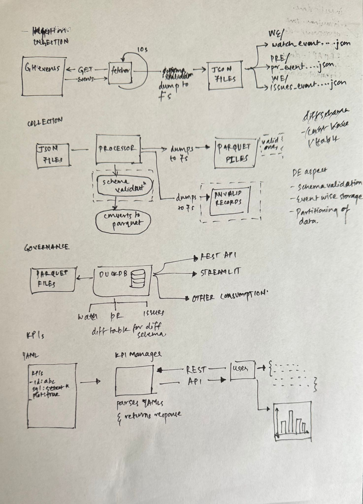
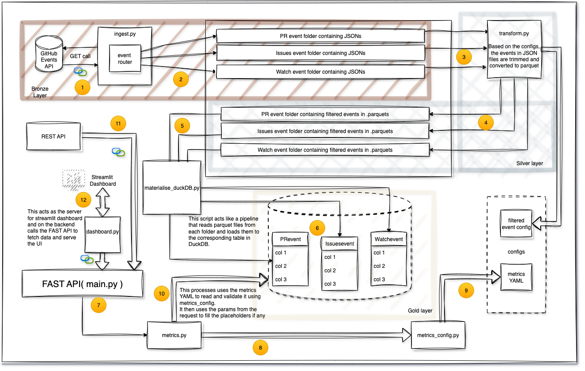
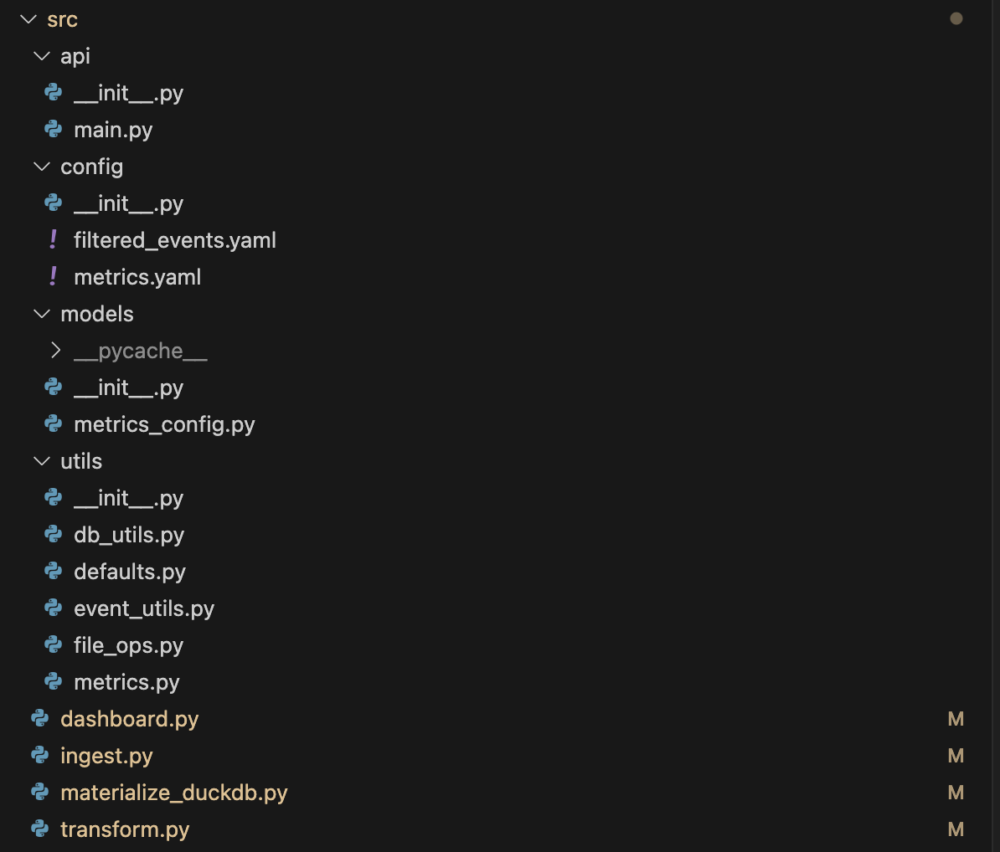

# 📊 GitHub Event Metrics Pipeline

This project is a full-stack **data engineering pipeline** designed to ingest, transform, and expose GitHub event metrics in real time( well almost! ). It is created using Python and leverages modern tools like **DuckDB**, **FastAPI**, **Streamlit**, and **Poetry**, and is fully containerized using **Docker**.


## 🚀 Features

- 🔄 **Live ingestion** of GitHub events (`WatchEvent`, `PullRequestEvent`, `IssuesEvent`) via the GitHub Events API.
- 🪵 **Bronze–Silver–Gold** layered architecture(inspired from the Medallion architecture in Azure) for data quality and traceability:
  - **Bronze**: Raw JSON data
  - **Silver**: Cleaned and schema-aligned Parquet files
  - **Gold**: Materialized tables in DuckDB with KPI logic
- 📈 Real-time **metrics API** via FastAPI
- 📈 Parameterised and easy to alter metrics Defintion via YAMLs
- 📊 Interactive **dashboard** via Streamlit (supports table + visualizations)
- 🐘 Lightweight, **embedded OLAP engine** using DuckDB
- 📦 Easily reproducible with Docker and Poetry


## 🧰 Data Engineering Concepts Covered

| Concept                     | Covered       |
|----------------------------|---------------|
| Ingestion (batch & streaming) |  Live & on-demand |
| Raw → Cleaned → Modeled data layers |  Bronze/Silver/Gold |
| Data modeling              |  Metric definitions via YAML |
| Workflow orchestration     |  Simple control via flags/scripts |
| API Layer for metrics      |  FastAPI-based |
| Visualization              |  Streamlit dashboard |


## Architecture

The intial thoughts/ architecture I put down on the paper is as follows:


The detailed and implemented architecure can be seen below:


The sequencing in yellow circles walks one through the entire flow.

The above diagram illustrates the architecture of the data pipeline that processes GitHub event data and serves it through a Streamlit dashboard using FastAPI.

- Bronze Layer (Data Ingestion):

The process begins with a GET call to the GitHub Events API, which fetches event data.

The data is routed through an event router and saved as JSON files in different folders based on event types: PR events, Issues events, and Watch events.

- Silver Layer (Data Transformation):

A transform.py script processes the JSON files by trimming and converting them into Parquet format, based on configurations.

The transformed Parquet files for each event type are saved in their respective folders.

- Gold Layer (Data Storage):

The materialise_duckDB.py script loads the Parquet files into DuckDB tables (PR events, Issues events, Watch events) for efficient querying and analysis.

- API Layer:

FastAPI serves as the backend API, managing the interactions and fetching data for the Streamlit dashboard. It also uses a metrics YAML to validate and configure the metrics request.

The metrics.py script ensures the metrics configuration is applied and fills in any parameters from the request.

- Streamlit Dashboard:

A Streamlit dashboard presents the data and allows user interaction. The dashboard fetches data from FastAPI via the REST API and presents it in an interactive format.


## Assumptions

While working on this assignment I have tried to maintain a fair balance of showcasing my python and data engineering skills. There are some assumptions I had to make in order to incorporate this:
- In the current setup the materialisation actually creates and write to a DB file. My assumption here is that I would envision this as a query engine that runs on flat files, there by reducing the overhead of database storage.
- I wanted to implement a day paritioning on the storage level to allow for specific data selection, but since I am not running the pipelines for that long - I could not do that. Ideally the day partitioning should help narrow down the records to be selected for every query, there by optimising querying costs.


## 🏗️ Project Structure



In this I have 4 sub folders:
 - api
    - contains the FastAPI that can be used to fetch different metrics.
 - config
    - contains the config for metrics to fetch with their definitions and queries. 
    - contains the config for which attributes to consider while filtering the events.
 - models
    - contains the pydantic model to verify the integrity of the metrics config file to avoid any parsing issues. 
 - utils
    - contains the general and reusable pieces of code that are used across multiple services.


## ▶️ How to Run Locally

If you want to run locally ensure you have Docker installed. Then fire the following commands from the root directory:

```
docker build -t gh-events .
```
this shold build your docker image.

There are 2 modes to run the setup 
- **live mode** (streaming mode - where all underlying applications stream events -> process them -> load them to DB -> available in metrics) 
- **batch mode** ( where all applications run exactly ones for a predefined duration of 5 mins. Ingestion runs for 5 mins. Others just do their task and end except). In both the cases the API and the interactive Streamlit dashboard remains available unless terminated.

To run in Batch mode:
```
docker run -p 9000:9000 -p 8501:8501 -e LIVE=false gh-events
```
for live mode:
```
docker run -p 9000:9000 -p 8501:8501 -e LIVE=true gh-events
```
Regardless of the mode, you can access the API and the dashboard on the following links:

FastAPI: http://localhost:9000/docs

Dashboard: http://localhost:8501

Unit tests are located in the `tests/` directory and can be run using:

```
PYTHONPATH=src poetry run pytest tests/
```

## Data flow in brief
For ingestion, I have added a while loop in the code that based on the live param runs either indefinitely or for a configured duration. In either case, the code makes a call, then sleeps for 10s before making the next call. The interval between the calls can be configured. Also the duration of the execution can be passed as a param using the duration keyword. The code maintains a deque, which is dumped in a JSON file after the configured event count is reached. We are maintaining 3 diff deques for 3 events.

For transform, again we have a loop which based on the live param can run indefinitely or do a one time execution and end. The transform layer picks data from the bronze folder -> processes it and dumps it as parquet file in the silver folder.

For materialisation, execution strategy is same as that in the case of transform. This job keeps reading the parquet file locations and keeps updating the 3 tables in DuckDB. If the tables dont exist, the job would create them.


## FAQs

### How to test with API calls?
Once you have started the docker container - go to http://0.0.0.0:9000/kpi/avg_pr_time for fetching avg time between PRs.
For event count, go to http://0.0.0.0:9000/kpi/event_count_offset?offset=500 withthe desired offset to get the count of events collected.

### How is the data handled in this setup?
I have tried to follow the medallion architecture by having 3 layers - bronze, silver and gold as highlighted above. Bronze layer contains event wise json files as pulled from Github. Silver layer contains the corresponding parquets for the json files with selected event attributes as defined in the config. Finally the gold layer is the data loaded to the DB. IN this case DuckDB.

### Why did you use DuckDB?
DuckDB is very light and gives the feeling of querying a full size database while maintaining a small footprint. Also this allows me to not only simplify my API DAL layer, but also avoids the whole hastle of connecting to a cloud and sharing credentials while demonstrating the important concept of a lakehouse locally.

## What are the consumption options for the data in the gold layer?
The data in the gold layer can be consumed in 2 ways - The REST API and via the streamlit dashboard. Both are configured to deliver data on 2 metrics - avg time between PR for a repo and the count of events. It can be further extended by adding new metrics to the Metrics YAML file. For streamlit - you will have to create a new tab and then add sections to accommodate it.

## Why did you use Streamlit? What is it and what is the purpose?
Streamlit is a lightweight Python framework for building fast, interactive web apps for data science and machine learning. It lets you turn Python scripts into shareable dashboards with minimal code. With this problem statement it felt like the perfect match to be used.


# 📌 Future Scope

- Schedule batch runs using an orchestrator.
- Add more comprehensive logging.
- Add monitoring and alerting capabilities.
- Introduce retry & backoff strategies for ingestion.
- Add S3/GCS upload for long-term storage, with a more clear execution of lakehouse architecture.
- Support more GitHub event types dynamically.
- Adding support for schema validation and evolution.
- Add integration tests and CI/CD via GitHub Actions.
- Add auth to the FastAPI endpoints.
- Add time-series visualizations and repo filtering in dashboard.
